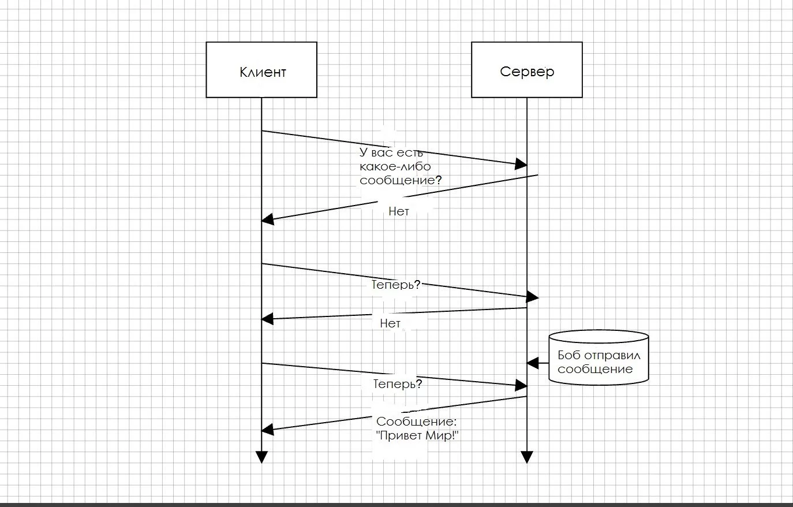
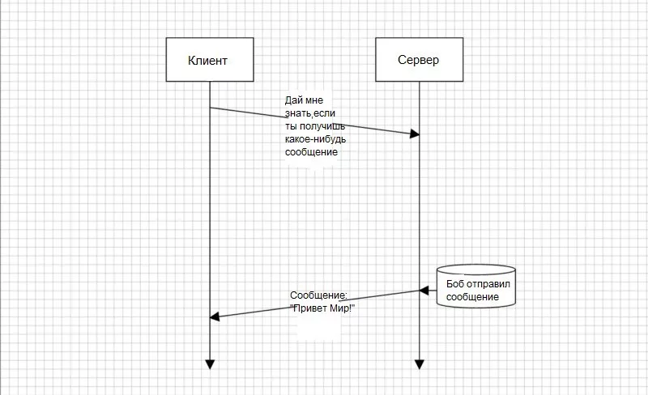
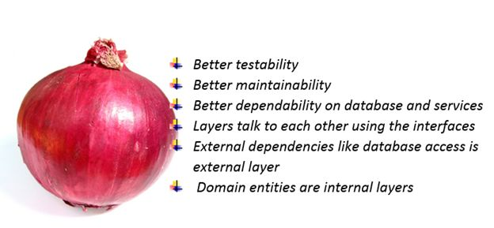
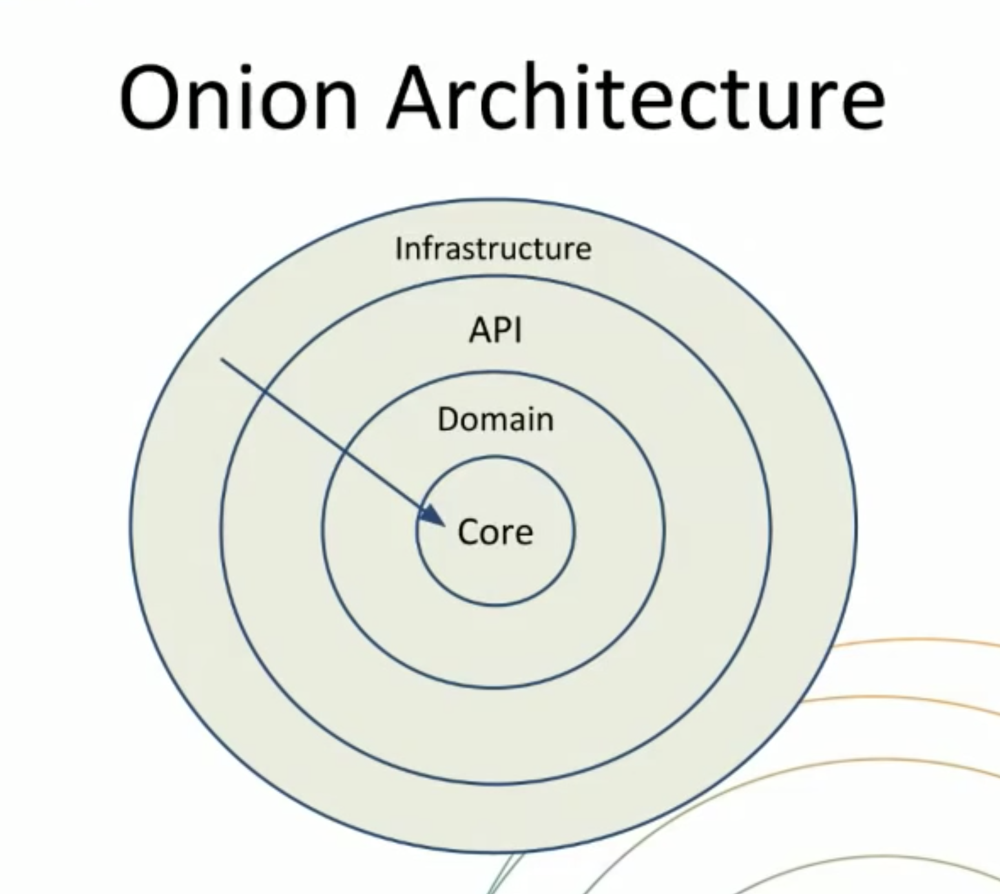

# Lesson 8

- Websocket vs HTTP
- socket.io
- Чат

## Websocket

WebSocket — протокол дуплексной связи (может передавать и принимать одновременно) поверх TCP-соединения, предназначенный для обмена сообщениями между браузером и веб-сервером в режиме реального времени.
Веб-сокеты, в отличие от HTTP, позволяют работать с двунаправленным потоком данных, что делает эту технологию совершенно уникальной.

Чем же эта технология отличается от HTTP?

- В HTTP 1.1 (используется почти везде на данный момент) единственный вариант получить что-то от сервера - это отправить на него запрос. Для каждого запроса создается одно подключение к серверу. В одно время может быть только 6 одновременных подключений к одному домену. И это самая важная особенность.

- В HTTP 2.0 (новый стандарт) появилась технология Server Push и Server Side Events, которая позволяет передавать данные с сервера на клиент и наоборот. Новая версия HTTP протокола может составить конкуренцию вебсокетам, но на данный момент она не так широко используется.
 

Бывает много ситуаций когда нам нужно получить какие-то данные из сервера, которые от нас не зависят. Например сообщение от другого пользователя, либо же сообщение что на сервере закончилась обработка большого файла или еще что-либо.

Единственный способ что позволяет нам сделать такое в HTTP 1.1 версии - это полинг. Другими словами "опрос" сервера, отправка запросов через определенный интервал с надеждой что сервер уже имеет данные что нам нужны.

###Пример HTTP pooling



**Возможная реализация полинга**

```
(() => {
   const interval = 2000;
   
   const poll = () => { 
       setTimeout(function(){
          $.ajax({ 
            url: 'https://api.example.com/endpoint', 
            success: function(data) {
            
            if (!data) {
              // Рекурсивно выполняем следующий запрос
              poll();
            }
              // Делаем что-то с `data`
              
            }, 
            dataType: 'json'
          });
      }, interval);
  }
})();
```

###Пример websocket подключения



Веб-сокетам же для ответа не нужны повторяющиеся запросы. Достаточно выполнить один запрос и ждать отклика. Вы можете просто слушать сервер, который будет отправлять вам сообщения по мере готовности.

Веб-сокеты можно использовать для

- приложения реального времени;
- чат-приложения;
- IoT-приложения;
- многопользовательские игры.

### Сложности в использовании websocket подключения

- с помощью websocket вы не сможете реализовать REST API для других клиентов. Вебсокет не поддерживает CORS.

#### Примеры 

**Client**

```
<!DOCTYPE html>
<html>
<head>
  <title>Пример чата с веб-сокетом</title>
</head>
<body>
  <script>
    let ws = new WebSocket("ws://localhost:8080");
    // выводим новые сообщения в консоль
    ws.onmessage = ({data}) => {
      console.log(data);
    }
    // отправляем сообщение 
    ws.onopen = () => ws.send('Text');
  </script>
</body>
</html>
```

**Server**

```
const WebSocket = require('ws');

// создаём новый websocket-сервер
const wss = new WebSocket.Server({
  port: 8080
});

//  отправляем клиентам, когда функция clientValidator возвращает true. this — это wss.
wss.broadcast = function(data, clientValidator = () => true) {
  this.clients.forEach(client => {
    if (clientValidator(client)) {
      client.send(data);
    }
  });
}

wss.on("connection", ws => {
  // событие будет вызвано, когда клиент отправит сообщение
  ws.on('message', message => {
    //  отправляем сообщение всем, кроме автора
    wss.broadcast(message, client => client !== ws);
  });
});
```

- [Статья о вебсокетах](https://tproger.ru/translations/what-are-web-sockets/)
- [Статья об HTTP2 server push & server side events](https://habr.com/company/ruvds/blog/342346/)


### socket.io

Socket.IO это библиотека что предоставляет удобную комуникацию клиента с сервером посредством передачи сообщений. Работает на websocket подключении.

В библиотеку входит:

- Node.js сервер
- Javascript библиотека для клиента

Кроме того, библиотека предоставляет такие функции как: 
- Переподключение в случае потери соединения (например пропал интернет). Клиент будет постоянно пытаться повторно подключиться пока сервер не будет доступен снова. 
- Обнаружение разъединения с сервером/клиентом. Механизм позволяет как серверу, так и клиенту узнать если другой не отвечает.
- Возможность передачи файлов (Binary data) ArrayBuffer и Blob в браузере и Node.js
- Поддержка мультиплексирования (создание нескольких неймспейсов)
- Создание "комнат". В пределах каждого неймспейса вы можете определить произвольные каналы, называемые «Комнаты». К ним могут присоединиться сокеты. Затем вы можете транслировать сообщения любую комнату к которой присоединился сокет. Эта функция может быть полезнаой для отправки уведомлений группе пользователей или конкретному пользователю подключенному к нескольким устройствам.
  
Пример: 

```
io.on('connection', function(socket){
  socket.emit('request', /* */); // emit an event to the socket
  io.emit('broadcast', /* */); // emit an event to all connected sockets
  socket.on('reply', function(){ /* */ }); // listen to the event
});
```

- [Документация](https://socket.io/docs/)


- Дизайн гибкой архитектуры в node.js
 
## Дизайн чистой архитектуры в node.js 

Плохая архитектура характеризуется 2мя терминами: 
- **хрупкостью**  приложение ломается в местах которые не связаны с вносимыми изменениями.
- **жесткостью** для добавление даже тривиальной новой фичи приходится вносить очень много изменений во много модулей приложения

Приложение становится похожим на стекло. Оно готово разбится при любом неудобном движении.
 
### Зачем делать "чистую" архитектуру

Она нужна для того чтобы:

 - отделить бизнес логику от деталей реализации
 - быть независимыми от базы данных, фреймворка или библиотеки
 - использовать чистые функции где только можно
 - упростить тестирование проекта
 - сделать добавление новых фич очень простым
 - сделать перенос логики очень простым


### Луковая архитектура

Хорошим примером гибкой архитектуры является **Onion architecture** (Луковая архитектура). 



Особенностью архитектуры является то, что она состоит из разных слоев логики и данных, которые похожи на слои лука.
Зная что нужно сейчас сделать мы понимаем в каком слое мы должны писать определенную логику.


### Onion architecture в деталях



Абстракции в примерах:

**Core, ядро системы**

- стоительные блоки с которых вы будете делать приложение
- логика которая не зависит от конкретного приложения
- в большинстве это чистые функции, которые получают определеннные данных и возвращают другие
- в Core никогда не должно быть импортов методов базы данных либо же request, response   
- Core не знает о других слоях вообще

**Domain, доменный слой**
- в этом слое находится логика вашего приложения
- использует фукцнии из Сore и связывает их в логику
- в домене не иcпользуются методы express
- в домене можно использовать DB
- вся структура должна быть разделена по сущностям нашего приложения (users, products, orders) 
 
**API, Gateway**

Все эти названия обозначают одно и тоже. Это фасад для работы с Domain и Core логикой вашего приложения

- должен возввращать имутабельные обьекты (чтобы исключить возможность мутации их в других модулях)
- может работать с Core и Domain модулями, но ничего не знает об Infrastructure

Пример методов в API:

* createOrder
* addProductToCart
* removeProductFromCart

* createUser
* login
* logout


**Infrastructure**

Слой который работает с базой данных и express напрямую


**Правило зависимости**

Круги представляют различные области программного обеспечения. В общем, чем дальше, тем выше уровень программного обеспечения. Внешние круги - это механизмы. Внутренние круги - это политика.

Главное правило, которое заставляет эту архитектуру работать, - это правило зависимости. Зависимости исходного кода могут указывать только внутрь круга, но не вне. 
Пример: модель не может импортировать в себя ничего из контроллера или сервиса.

**Модули, функции, классы внутреннего круга не могут знать ничего о тех же сущностях внешнго круга**. 

Имя чего-либо, объявленного во внешнем круге, не должно упоминаться кодом во внутреннем круге. Это включает в себя, функции, классы. переменные или любой другой названный программный объект.

Точно так же форматы данных (в нашем случае обьектов), используемые во внешнем круге, не должны использоваться внутренним кругом, особенно если эти форматы создаются структурой во внешнем круге.
Мы не хотим, чтобы что-то во внешнем круге влияло на внутренние круги.


[Статья о луковой архитектуре](https://blog.cleancoder.com/uncle-bob/2012/08/13/the-clean-architecture.html)

